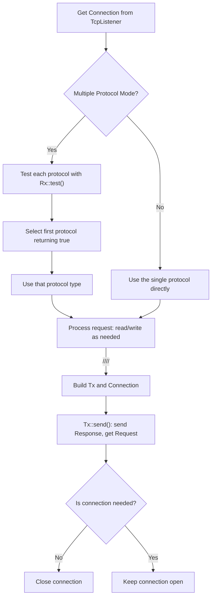

# Starberry Documentation for 0.6.1 (Core) 

# Chapter 0: New Concept Introduced 0.5.x and 0.6.x 

### Multi Protocol and new App Mechanism 



As the diagram shown above, Rx (Receive) and Tx (Transmit) are the 2 most important traits introduced in Starberry 0.6. All of the protocols are wrapped with them. 

This means that you will be able to define your own protocol in App, and very soon you will be able to use socket and ftp in starberry. Currently Http and Sql has been implemented 

For Http, a simple method is provided for sending a request to a server 

```rust 
let response = HttpResCtx::send_request(
    "https://api.pmine.org",                                        // Host, protocol, port 
    get_request("/num/change/lhsduifhsjdbczfjgszjdhfgxyjey/36/2"),  // Request content 
    HttpSafety::new().with_max_body_size(25565),                    // Safety configuration 
)
.await
.unwrap(); 
``` 

There are also other protocols that does not provide a shortcut or you maybe want to use more advanced settings for http request, you may use the following way 

(1) Building a connection with the server 

```rust
let builder = ConnectionBuilder::new("example.com", 443)
    .protocol(Protocol::HTTP)
    .tls(true);
let connection = builder.connect().await.unwrap(); 
``` 

(2) Create a new Tx (HttpResCtx is the struct implemented Tx in Http) 

```rust 
let mut request = HttpResCtx::new(
    connection, 
    HttpSafety::new().with_max_body_size(25565), 
    "example.com"
); 
``` 

(3) Insert the request by using the `Tx::prcess()` function 

```rust 
let _ = request.process(request_templates::get_request("/")).await; 
``` 

Because we need to borrow the reader from the HttpResCtx so we didn't use the &mut Response from the process() function, we directly use HttpReqCtx.response to further process 

```rust 
request.response.parse_body(
    &mut request.reader,
    1024 * 1024,
).await;
println!("{:?}, {:?}", request.response.meta, request.response.body); 
``` 

### Protocol Registry 

Protocol registry now manages middleware chains and handler registration through a unified API 

The `App` type no longer owns a global `Url` tree or middleware list. 

URLs and middleware must now be configured on the **protocol** level during protocol registration. 

You

```rust 
/// APP only have one inbound protocol 
pub static APP: SAPP = Lazy::new(|| {
    App::new()
        .single_protocol(ProtocolBuilder::<HttpReqCtx>::new()) 
        .build() 
});  


/// APP need multiple inbound protocols 
pub static APP_MULTI: SApp = Lazy::new(|| {
    App::new() 
        .protocol(HandlerBuilder::new()
            .protocol(ProtocolBuilder::<HttpReqCtx>::new()) 
            // .protocol(ProtocolBuilder:: /* .. /* ) <- Add another protocol 
        )
        .build() 
}); 
``` 

### SQL Support (Starberry SQL v0.6.0)

Starberry now includes first-class PostgreSQL support via the `starberry_sql` crate. This async Rust library provides:

- Simple query building (`SqlQuery`/`sql!` macro)
- Type-safe row mapping with `FromRow`
- Connection pooling (`SqlPool`)
- Full transaction support
- Prepared statements & batch execution

**Basic Example:**
```rust
use starberry_sql::{DbConnectionBuilder, sql, FromRow, SslMode};

#[derive(FromRow)]
struct User { id: i32, name: String }

#[lit_url(APP, "/users")]
async fn get_users(mut ctx: HttpReqCtx) -> HttpResponse {
    let builder = DbConnectionBuilder::new("localhost", 5432)
        .database("my_db")
        .ssl_mode(SslMode::Disable);
    
    let mut conn = builder.connect().await.unwrap();
    let users: Vec<User> = sql!("SELECT id, name FROM users")
        .fetch_all_as(&mut conn)
        .await
        .unwrap();
    
    json_response(&users)
} 
``` 

### Safty setting for APP & Cors support 

We are now able to add config to both APP and urls. For APP, we are able to set the config/static by using methods 

```rust 
pub static APP: SApp = Lazy::new(|| {
    App::new()
        .single_protocol(ProtocolBuilder::<HttpReqCtx>::new() 
            .append_middleware::<CookieSession>() // Append the cors middleware. The cors middleware's setting is a AppCorsSettings data  
        ) 
        .set_config( // Add a config data, which is a TypeID, Any HashMap 
            prelude::cors_settings::AppCorsSettings::new() // Store a data with the type of AppCorsSettings into config. The middleware will be able to figure this stored data out by using its TypeID 
        ) 
        .set_local( // Set a static data, which is a String, Any HashMap. When getting data you need to specify both String and Type 
            "key": "MySuperSecuredAdminKeyWhichIsSoLongThatCanProtectTheServerFromAnyAttack" 
        )
        .build() 
}); 
``` 

While for the Url, we are able to store params by using the `#[url]` macro 

```rust 
#[url(APP.reg_from(&[TEST_URL.clone(), LitUrl("get")]), config=[HttpSafety::new().with_allowed_method(HttpMethod::GET)])]  
async fn get_only() -> HttpResponse { 
    text_response("Get only")  
} 

#[url(APP.reg_from(&[TEST_URL.clone(), LitUrl("post")]), config=[HttpSafety::new().with_allowed_methods(vec![HttpMethod::POST])])]  
async fn post_only() -> HttpResponse { 
    text_response("Post only")  
}
``` 

### Unify Http Request and Http Response 

You may see in the new Http mod, request and responses are in the same structure of 

```rust 
pub struct HttpRequest {
    pub meta: HttpMeta,
    pub body: HttpBody
}

pub struct HttpResponse { 
    pub meta: HttpMeta, 
    pub body: HttpBody 
}  
``` 

Where `HttpMeta` and `HttpBody` both implemented different methods for sending/parsing request/response 

# Chapter 1: Hello Starberry! 

In this chapter, we are going to create a simpliest Http server by using Starberry 

### Installation: 

You can install starberry by using the following command 

```
cargo install starberry 
``` 

Once it is installed, you can run the following command to create a new starberry project: 

``` 
starberry new HelloStarberry 
``` 

This will automatically creates a folder called HelloStarberry. A minimal starberry project will be generated 

### The simpliest project 

Go to `src/main.rs`, let's dig dive into each line of code and see what they do. 

```rust main.rs 
use starberry::prelude::*; 
use example::APP; 
``` 

The first line of code shown above imports everything from `starberry::prelude`, this is basically everything you need for a standard starberry project 

After that, we import the APP from lib.rs 

In the tokio environment (note you don't need to import tokio because starberry did that for you automatically), you clone the App instance called APP and run it. 

```rust main.rs 

#[tokio::main]
async fn main() {
    APP.clone().run().await;
} 
``` 

After putting all things ready in `main.rs`, we need to build APP in `lib.rs`. 

We define our APP by using Lazy. Note that the type created from `App::build()` is not `App` directly, for simplicity we use `SAPP` for represent some static executable in Starberry 

```rust lib.rs 
pub static APP: SApp = Lazy::new(|| {
    App::new().build()
}); 
``` 

This defines a Static App variable by using lazy. Note that you also don't need to import Lazy since starberry did this automatically. 

```rust 
#[url(APP.lit_url("/"))] 
``` 

`APP.lit_url('/')` meaning that generate a Url instance from APP where the url is "/". By passing this into the `#[url()]` macro this links the function below with this url instance. 

```rust 
async fn home_route() -> HttpResponse {
    text_response("Hello from Starberry!")
} 
``` 

This function returns a text HttpResponse which is `Hello from Starberry!` 

After compiling the app and run it, you may visit localhost:3003 (the default port for starberry), it will returns "Hello from Starberry!" 

# Chapter 2: Register static functions to the APP 

### Basic URL pattern types 

Url is associated with "Patterns" in starberry. Url patterns is an enum consists of 4 types 

| Type name | Actual Name | Note | 
| --- | --- | --- | 
| LitUrl(String) | Literal(String) | | 
| RegUrl(String) | Regex(String) | | 
| AnyUrl() | AnyUrl | This only accepts one string. A path will not be accepted | 
| AnyDict() | AnyPath | This accepts a path, a string will also be accepted | 
| TrailingSlash() | Literal("") | | 

*Note: Type name is the function you actually use in your application to define urlpattern where the Actural name is the actual name defined in the enum. You will not use the Actual name very often 

By using `reg!` macro, you may associate patterns with App or Url instance to register them 

For example, 

```rust 
#[url(reg![&APP, LitUrl("test"), RegUrl("[0-9]+")])]  
async fn testnumber() -> HttpResponse { 
    text_response("Number page") 
} 
``` 

Then you may visit this page through the url of `/test/123` (Actually you can visit the same page with any number after /test/) 

*Note: Please notice there is no trailing slash. The url with or without trailing slash are different 

While also note that each UrlPattern can only match one part of the path. Which means that you must not use `LitUrl("aaa/bbb")`, instead you should use `LitUrl(aaa), LitUrl("bbb")` 

There is another way of registering url, 

```rust
APP.reg_from(&[LitUrl("test"), RegUrl("[0-9]+")]) 
``` 

This provides the same effect as the one above, but the grammar is much complicated. Since starberry 0.4.5, we provide the macro to register the Url 

You may also define a static url pattern for easier change: 

```rust 
static TEST_URL: SPattern = Lazy::new(|| {LitUrl("test")}); 
``` 

Then you may use 

```rust 
#[url(reg![&APP, TEST_URL, RegUrl("[0-9]+")])]   
``` 

To register. 

### Associate static data to URL or APP 

We able to add config to both APP and urls 

For APP, we are able to set the config/static by using `APP::set_config::<T>(data: T)` or `APP::set_local::<T>(key: Into String, data: T>)`  

```rust 
pub static APP: SApp = Lazy::new(|| {
    App::new()
        .single_protocol(ProtocolBuilder::<HttpReqCtx>::new() 
            .append_middleware::<CookieSession>() // Append the cors middleware. The cors middleware's setting is a AppCorsSettings data  
        ) 
        .set_config( // Add a config data, which is a TypeID, Any HashMap 
            prelude::cors_settings::AppCorsSettings::new() // Store a data with the type of AppCorsSettings into config. The middleware will be able to figure this stored data out by using its TypeID 
        ) 
        .set_local( // Set a static data, which is a String, Any HashMap. When getting data you need to specify both String and Type 
            "key": "MySuperSecuredAdminKeyWhichIsSoLongThatCanProtectTheServerFromAnyAttack" 
        )
        .build() 
}); 
``` 

In order to get the data from APP, we can use 

While for the Url, we are able to store params by using the `#[url]` macro 

```rust 
#[url(APP.reg_from(&[TEST_URL.clone(), LitUrl("get")]), config=[HttpSafety::new().with_allowed_method(HttpMethod::GET)])]  
async fn get_only() -> HttpResponse { 
    text_response("Get only")  
} 

#[url(APP.reg_from(&[TEST_URL.clone(), LitUrl("post")]), config=[HttpSafety::new().with_allowed_methods(vec![HttpMethod::POST])])]  
async fn post_only() -> HttpResponse { 
    text_response("Post only")  
}
``` 

Please note that because the APP should be static, so we are not able to set the config/statics of APP during the runtime. The best practise would be use a config file 

# Chapter 3: Return something dynamic & Introduction to Akari 

### Dynamic URL 

Starberry accepts dynamic url pattern, but how we are able to be benefited from this ability? Such as returning the number the user input after `/test/` 

In some other frameworks, we may define something like this: 

```python 
@app.url("/route/<number>") 
def number_function(number): 
    return render(number) 
``` 

Starberry does allow setting names for patterns, however this operation will be finalized in starberry v0.7 

You can only access the url through `req.get_path(<int: The part of the url>)` 

Let's change that function a little bit, 

```rust 
#[url(reg![&APP, LitUrl("test"), RegUrl("[0-9]+")])]  
async fn testnumber() -> HttpResponse { 
    text_response(req.get_path(1)) 
} 
``` 

This will get the **second** part of the url, which is the number part, in a text format. 

### Returning a Json or Template 

Except for text, akari gives us the ability to return in Json or Templates. 

We may use `akari_template!()` or `akari_json!()` to return them, below are 2 examples of how to do this 

```rust 
#[url(reg![&APP, LitUrl("test"), RegUrl("[0-9]+")])]  
async fn testnumber() -> HttpResponse { 
    akari_json!({ 
        number: req.get_path(1)
    }) // Return {number: ###} 
} 
``` 

OR 

```rust
#[url(reg![&APP, LitUrl("test"), RegUrl("[0-9]+")])]  
async fn testnumber() -> HttpResponse { 
    akari_template!({
        "number.html":
        number=req.get_path(1)
    }) 
} 
``` 

Where you need to add a new file into template folder which is at the same level as the src folder, 

```html number.html 
<h1>-[ number ]-</h1> 
``` 

So that a header will render the number the user input 

Akari template is a templating language, which wrap its syntax in `-[ ... ]-`. Please read more about that in Akari Template Guide 

### Akari Json and Introdcution to Akari Templates 

With the build-in ability of reading json files and templating in akari, we can easily manipulate json and render dynamic templates 

Akari json, officially akari object, can be constructed by using the `object!` macro. It is a json-like structure, and you are able to read and write data from it. 

```rust 
use akari::object; 
object!({
    number: 3, 
    string: "Hello", 
    array: [1, 2, 3], 
    object: { 
        a: 1, 
        b: 2, 
        c: 3 
    }
}) 
``` 

Then you can create a Json. 

Where you can also use 

```rust 
use akari::object; 
use akari::Value; 

let json = r#"{"key": "value", "number": 42, "list": [1, 2, 3]}"#; 
let obj = Value::from_json(json).expect("Failed to parse JSON"); 
let dir = "D://test/test.json"; 
Value::from_jsonf(dir).unwrap_or(Value::None); // Read a json from a file 
obj.into_jsonf(dir); // Write obj into the dir 
``` 

While various of methods are provided to read a value in json. 

Be carefun about the difference between `obj.to_string()`, `obj.string()` and `obj.into_json()` 

Please read more about Akari Json in Akari Json guide 

# Chapter 4: Quick example: Http Server in Starberry 

# Chapter 5: Core, Rx, Tx 

# Chapter 6: Application Layout and Introduction of Middlewares 

# Chapter 7: Deep seek into Http 

HttpRequest and HttpResponse consists of two parts, HttpMeta and HttpBody 

HttpMeta is "Lazy loading", which means that when generating the HttpMeta, it will just fetch all data as unparsed from the Buffered Reader and store it in a `HashMap: <String, String>`. 

Where when user tries to use the associated method, such as `get_content_type()`, starberry will do the following things 

(1): Check whether content_type has been cached 
(2): If it is being cached, directly return the cached data. **IT WILL NOT CHECK WHETHER THE HASHMAP HAS BEEN MODIFIED**, since the hashmap is designed to be write for only once, when it is initializing 
(3): If not, get the String data of content type from the hashmap, and convert it into HttpContentType. Cache it and return the data 

The same design is introduced in HttpBody also. The response will not be automatically being parsed. When you call the body getting method such as `Rc::form()` or `Rc::json()`, it first reads the buffer then store the compiled data into cache. 

Since 0.5, the Response and Request shares the same HttpBody and HttpMeta. However in 0.4 these attributes only applies to Request side 

# Chapter 6: Request context, Standard Middleware and Building Application 

### Request Context 

Request context, (we call this "Rc" for short in starberry) is a struct consisting the Request Meta, Request Body, Request Stream, Response, locals and params. 

As discussed in Chapter 4 and 5, we already know how to read data from request and send response. In this chapter we are going to focus more on Stream, locals and params. 

Stream is a buffer reader, reading the TcpStream that the user send to the server. Since the RequestBody is lazy load, you may read the body on your own without relying on Starberry's HttpBody. While it is technically possible to read data the user send after we receive the request, however this does not happen in Http1.1. Starberry will be able to handle Http2.0 response later on 

For locals and params, they are 2 sets of data passing through Middleware Chain (which we are going to discuss later on). 

Where params stores a value in the type-based params storage. Any previous value of the same type will be replaced. 

You may do something like 

```rust 
// Store authentication information
req.set_param(User { id: 123, name: "Alice".to_string() });
 
// Store timing information
req.set_param(RequestTimer::start()); 

// In an authentication process. We do not write this syntax in actual middlewares 
if let Some(user) = req.param::<User>() {
    println!("Request by: {}", user.name);
    // Proceed with authenticated user
} else {
    return HttpResponse::unauthorized();
} 

// Update a request timer
if let Some(timer) = req.param_mut::<RequestTimer>() {
    timer.mark("after_db_query");
} 

// Take ownership of a value
if let Some(token) = req.take_param::<AuthToken>() {
    // Use and consume the token
    validate_token(token);
} 
``` 

To store data. No key is provided. 

However for locals, it stores a value in the string-based locals storage with the given key. Any previous value with the same key will be replaced 

```rust 
req.set_local("user_id", 123);
req.set_local("is_premium", true);
req.set_local("cart_items", vec!["item1", "item2"]); 

// In a request handler
if let Some(is_premium) = req.local::<bool>("is_premium") {
    if *is_premium {
        // Show premium content
    }
}

// With different types
let user_id = req.local::<i32>("user_id");
let items = req.local::<Vec<String>>("cart_items"); 

// Modify a list of items
if let Some(items) = req.local_mut::<Vec<String>>("cart_items") {
    items.push("new_item".to_string());
} 

// Take ownership of a value
if let Some(token) = req.take_local::<String>("session_token") {
    // Use and consume the token
    validate_and_destroy_token(token);
} 
``` 

### Standard Middleware 

Installing sbmstd to use starberry's standard middleware library 

### Building Application 

In Chapter 1, we talked about starting a fairly application 

```rust 
pub static APP: SApp = once_cell::sync::Lazy::new(|| {
    App::new().build()
}); 
``` 

Now let's deep dive into setting configs, middlewares and settings in the application 

The statement 

```rust 
App::new() 
``` 

Initiates an AppBuilder instance. For the AppBuilder instance a set methods passing its owned value in while returning a modified owned value out is provided. 

After manipulating and setting the variable into the AppBuilder, we use 

```rust 
AppBuilder::build() 
``` 

To build and return a App instance. **Once a APP instance is built, you are not allowed to change its config**. 

For example, in the Starberry example project the following code is provided 

```rust 
    App::new() 
        .binding(String::from("127.0.0.1:1111"))
        .mode(RunMode::Build)
        .max_body_size(1024 * 1024 * 10) 
        .max_header_size(1024 * 10) 
        .append_middleware::<PrintLog>() 
        .append_middleware::<MyMiddleWare2>() 
        .insert_middleware::<MyMiddleWare1>() 
        .set_config("serect_key", "key") 
        .set_statics("static".to_string())
        .build() 
``` 

Let's talk about each function 

- Binding: The way of accessing the application 
- Mode: Production (Production environment), Development (Developing the application), Beta (Testing the application publically), Build (Internal testing for Starberry development) 
- Max body size, max header size 
- Append middleware: Append a middleware in the end of the middleware chain 
- Insert middleware: Insert a middleware in the head of the middleware chain 
- Set config: the same as set_local in Rc 
- Set statics: the same as set_params in Rc 

After that the APP is built and run 

# Chapter 7: Form, file and Akari Json 

# Chapter 8: Cookies & Session 

# Chapter 9: Advanced Akari operations & templating 

### Akari Object 

Akari Object, as discussed in Chapter 3, is a Json like data structure. This also leads to the result of that Akari Object is never type safe 

Akari Object is able to hold 5 types of value, they are: numerical, boolean, String, List and Object 

You may extract the value from Akari by using `match` or `if let`, just like any other Rust enums. You may also use a shorthand, just append the data type after the value, such as 

```rust 
let a = object!(3); 
assert!(a.numerical, 3.0); // Akari stores numericals as float 
assert!(a.boolean, true); // Akari applies auto conversion, if != 0.0 then return true 
``` 

### Akari template 

**Note: Some grammar does not implemented in 0.2.2 (The version used in default in Starberry 0.4.7), but you may update this manually** 

**Extend, Insert and Blocks** 

**Accessing dictionaries and lists** 

# Chapter 10: Middlewares 

### The easiest middleware 

Defining a new middleware in Starberry is farily simple. By using `#[middleware]` macro, starberry will automatically transfer your function into a middleware. The middleware will have the same struct name as the function. 

Please write your function name in UpperCamelCase, not the normal sname_case 

```rust 
#[middleware]
pub async fn MyMiddleWare1(){ 
    println!("Middleware: Received request for {}, start processing", req.path()); 
    next(req)  
}  
``` 

The code above shows a most simple middleware, which has the functionality of printing the path of requests 

Let's break down line by line. 

```rust 
#[middleware] 
pub async fn MyMiddleWare1(){ 
``` 

The first line gives the middleware name. It accepts one argument, Rc. The reason why we keep the parameter empty is that starberry automatically added `mut req: Rc` in the parameter for us, so we don't need to write it 

If you really want to change the name, you may explicitly write this into the parameter, then you can use your custom name 

```rust 
    println!("Middleware: Received request for {}, start processing", req.path());  
``` 

Do the thing this middleware needed to do 

```rust 
    next(req)  
``` 

The next is a keyword in starberry middleware. You need to pass your current request context into it, then it will pass the Rc into the next middleware, the middleware chain continues 

```rust 
} 
``` 

Closing the middleware function, and directly returns next(req) 

### Run after the middleware chain 

```rust 
#[middleware]
pub async fn MyMiddleWare2(){ 
    let path = req.path().to_owned(); 
    let a = next(req).await; 
    println!("Middleware: Received request for {}, end processing", path); // You cannot access to req here 
    a.boxed_future() // You must return a future 
}  
``` 

The middleware above prints a statement after the middleware chain. 

Note that now you must use the boxed_future since async middleware expects you return a future 

### Early abort  

```rust 
#[middleware]
pub async fn MyMiddleWare3(){ 
    if req.path() == "/directly_return" { 
        req.response = text_response("Directly return"); 
        req.boxed_future() 
    } else {
        next(req) 
    } 
} 
``` 

This middleware checks whether the path is `/directly_return`, if true it directly returns a text_response by setting the req's response into a HttpResponse and not passing the Rc into the middleware chain 

### Accessing values 

Please refer to the chapter of Request Context. In the middleware you may read and write in request contest's locals and params for passing values 
