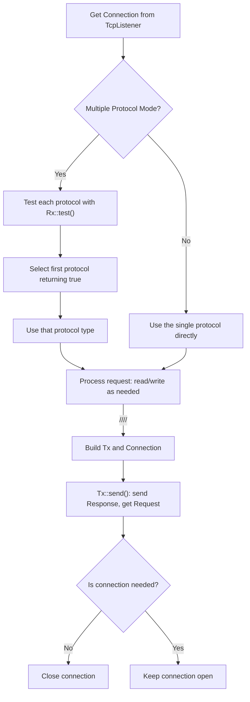

# Starberry Web Framework


[](https://crates.io/crates/starberry)
[](LICENSE)

> Small, sweet, easy framework for full-stack Rust web applications

## 📋 Overview

Starberry is a lightweight, intuitive web framework focused on simplicity and productivity. It supports regex-based routing, tree-structured URLs, and integrates seamlessly with the Akari templating system.

**[Example project](https://github.com/Field-of-Dreams-Studio/starberry-example/tree/main)**

## ✨ Key Features

- **Simple API**: Intuitive request/response handling with minimal boilerplate
- **Full-Stack**: Built-in template rendering with Akari templates
- **Flexible Routing**: Support for regex patterns, literal URLs, and nested routes
- **Asynchronous**: Built with Tokio for efficient async handling
- **Form Handling**: Easy processing of form data and file uploads
- **Middleware Support**: Create reusable request processing chains 
- **Multi-Protocal Support**: Starberry is now planning to handle ingoing or outgoing http(s), ws(s), db and other tcp protocals. This feature will come with the **0.6 stable version** 

## 🎇 New Features 

### Multi Protocol and new App Mechanism 



As the diagram shown above, Rx (Receive) and Tx (Transmit) are the 2 most important traits introduced in Starberry 0.6. All of the protocols are wrapped with them. 

This means that you will be able to define your own protocol in App, and very soon you will be able to use socket and ftp in starberry. Currently Http and Sql has been implemented 

For example, you may send an Http request by 

(1) Building a connection with the server 

```rust
let builder = ConnectionBuilder::new("example.com", 443)
    .protocol(Protocol::HTTP)
    .tls(true);
let connection = builder.connect().await.unwrap(); 
``` 

(2) Create a new Tx (HttpResCtx is the struct implemented Tx in Http) 

```rust 
let mut request = HttpResCtx::new(connection, "example.com"); 
``` 

(3) Insert the request by using the `Tx::prcess()` function 

```rust 
let _ = request.process(request_templates::get_request("/")).await; 
``` 

Because we need to borrow the reader from the HttpResCtx so we didn't use the &mut Response from the process() function, we directly use HttpReqCtx.response to further process 

```rust 
request.response.parse_body(
    &mut request.reader,
    1024 * 1024,
).await;
println!("{:?}, {:?}", request.response.meta, request.response.body); 
``` 

### Protocol Registry 

Protocol registry now manages middleware chains and handler registration through a unified API 

The `App` type no longer owns a global `Url` tree or middleware list. 

URLs and middleware must now be configured on the **protocol** level during protocol registration. 

You

```rust 
pub static APP: SApp = once_cell::sync::Lazy::new(|| {
    App::new() 
        .protocol(HandlerBuilder::new()
            .protocol(ProtocolBuilder::<HttpReqCtx>::new()) 
            // .protocol(ProtocolBuilder:: /* .. /* ) <- Add another protocol 
            .build() 
        )
        .build() 
}); 
``` 

### Argumented URLs 

Two new kinds of url has been introduced in the 0.5 version, which is `PatUrl` and `ArgUrl`. 

Both of them support aliasing url, and you may use the given name to look for them. This solves the problem of we can only get the url segment by inputting index in `HttpReqCtx::get_path()`. We may insert the name in `HttpReqCtx::get_arg()` to look for it 

### Sql support 

### Unify Http Request and Http Response 

You may see in the new Http mod, request and responses are in the same structure of 

```rust 
pub struct HttpRequest {
    pub meta: HttpMeta,
    pub body: HttpBody
}

pub struct HttpResponse { 
    pub meta: HttpMeta, 
    pub body: HttpBody 
}  
``` 

Where `HttpMeta` and `HttpBody` both implemented different methods for sending/parsing request/response 

## 🚀 Getting Started

### Installation

Install starberry bu using 

```
cargo install starberry 
``` 

After installing starberry, use 

```
starberry new <Proj_name> 
``` 

To create a new project 

### Quick Start

```rust
use starberry::prelude::*; 

#[tokio::main]
async fn main() {
    APP.clone().run().await;
}

pub static APP: SApp = Lazy::new(|| {
    App::new().build()
});

#[lit_url(APP, "/")]
async fn home_route() -> HttpResponse {
    text_response("Hello, world!")
}
```

Visit your server at `http://localhost:3003`

### Project Structure

```
project/
├── src/
│   ├── main.rs
│   ├── lib.rs
│   └── ... 
├── programfiles/ 
│   ├── config.json 
│   └── ... 
└── templates/
    ├── base.html
    ├── index.html
    └── ... 
``` 

Program file folder is used to store the config of the program data generated during the process of running the program. The files are automatically copied to the `dist` directory when you run `starberry build`. 

Templates are automatically copied to the `dist` directory when you run `starberry build`. 

### Stable Versions 

| Version | Download | Notes | 
| --- | --- | --- | 
| 0.6.4 | Not released | | 
| 0.4.7 | `cargo install starberry@0.4.7` | Async + Request Context | 
| 0.3.3 | `cargo install starberry@0.3.3` | Sync Starberry | 

## 📝 Usage Guide

### URL Registration

#### Method 1: Using Macros (Recommended)

```rust
// Absolute URL
#[url(APP.lit_url("/random/split/something"))]
async fn random_route() -> HttpResponse {
    text_response("A random page")
}

// Relative URL with parent
#[url(reg![&APP, LitUrl("hello")])]
async fn hello() -> HttpResponse {
    text_response("Hello, world!")
}
```

#### Method 2: Dynamic Registration

```rust
let furl = APP.clone().reg_from(&[LitUrl("flexible"), LitUrl("url")]);
furl.set_method(Arc::new(flexible_access));
```

### URL Pattern Types

| Type | Description | Example |
|------|-------------|---------|
| `LitUrl(&str)` | Matches literal path segment | `LitUrl("users")` |
| `RegUrl(&str)` | Matches regex pattern | `RegUrl("[0-9]+")` |
| `AnyUrl` | Matches any single path segment | `AnyUrl` |
| `AnyDir` | Matches any number of path segments | `AnyDir` |

### Request Handling

```rust
#[url(APP.lit_url("/submit"))]
async fn handle_form() -> HttpResponse {
    if request.method() == POST {
        // Form data (application/x-www-form-urlencoded)
        let form = req.form_or_default().await;
        
        // Access form fields
        let name = form.get_or_default("name");
        let age = form.get_or_default("age");
        
        // File uploads
        if let Some(files) = request.files().await {
            if let Some(file) = files.get("file") {
                // Process file
                let file_data = file.data().unwrap();
                // ...
            }
        }
        
        return akari_json!({
            name: form.get_or_default("name"),
            age: form.get_or_default("age")
        });
    }
    
    text_response("Method not allowed").with_status(405)
}
```

### Templating

```rust
#[url(APP.lit_url("/template"))]
async fn template() -> HttpResponse {
    akari_template!(
        "template.html",
        title="My Website - Home",
        page_title="Welcome to My Website",
        show_message=true,
        message="Hello, world!",
        items=[1, 2, 3, 4, 5] 
    )
}
```

**Template Example:**

```html
-[ template "base.html" ]-

-[ block head ]-
<link rel="stylesheet" href="style.css">
<meta name="description" content="My awesome page">
-[ endblock ]-

-[ block content ]-
<div class="container">
    <h2>-[ page_title ]-</h2>
    
    -[ if show_message ]-
        <div class="message">-[ message ]-</div>
    -[ endif ]-
    
    <ul class="items">
        -[ for item items ]-
            <li class="item">-[ item ]-</li>
        -[ endfor ]-
    </ul>
</div>
-[ endblock ]-
```

### Working with Cookies

```rust
#[url(APP.lit_url("/cookie"))]
async fn set_cookie() -> HttpResponse {
    text_response("Cookie Set").add_cookie(
        Cookie::new("global_cookie", "something").path("/")
    )
}
```

### JSON Responses

```rust
#[url(APP.lit_url("/api/data"))]
async fn api_data() -> HttpResponse {
    akari_json!({
        success: true,
        data: {
            id: 1,
            name: "Example",
            values: [10, 20, 30]
        }
    })
}
```

### Redirects

```rust
#[url(APP.lit_url("/redirect"))]
async fn redirect() -> HttpResponse {
    redirect_response("/new-location")
}
```

## 📋 Changelog 

### 0.6.2 
- Bug fix for Regex Url 
- Protocol Registery handling middleware and handlers 
- **Important Syntax Change** 
    - Now APP is no longer associated with a Url & Middleware. Url will be associated with protocol 
    - This means that you will need to to middleware operation when you creating protocol 
    - Please read more in our documentation: https://fds.rs/starberry/tutorial/0.6.4/ 

### 0.6.1 
- Language struct built in Http mod 
- Static file serving response (with auto assigned content type) 
- Bug fix & Update Akari 

### 0.6.0 
- Change the design of APP to enable multi-protocol 
- Added database support 
- Languages are readable from headers 

### 0.5.1 
- Reform Cookie and CookieMap, deleted the CookieResponse struct 
- Merge Request's Meta & Body and Response's into one unified struct 
- **Important Bug Fix** 
    - Able to send Redirect Response. Redirect Response will send nothing in previous 0.5.x version 
    - Starberry now can be compiled on Windows devices 

### 0.5.0 
- Enable sending requests through a Connection 
- Argumented URL 

### 0.4.x and earlier 
- Request Context holding all contexts of a request 
- Simplified middleware definition pattern & Standard middleware library 
- Added Akari templating support
- Added cookie manipulation
- File upload handling
- Form data processing improvements 

## 🔮 Planned Updates

**All planned updates for 0.4 is already finished** 

(0.5 ver) 
- [x] Standard middleware library (Session) 
- [x] Merge HttpRequestBody and HttpResponseBody together 
- [x] Enable sending simple requests to external server 
- [x] Enable form and file send() & get_size() out to external server 
- [x] URL segment parameters 

- [x] Merge HttpRequestMeta and HttpResponseMeta together 
- [x] Optimize Cookie data structure, unify Request Cookie and Response Cookie together 
- [ ] Grammar sugar for Regex 

- [ ] Middleware libraries (OAuth, Surreal) 
- [x] Static file serving 
- [ ] Logging 

## 📚 Learn More

Learn more about Akari template: https://crates.io/crates/akari

## 📄 License

MIT License
